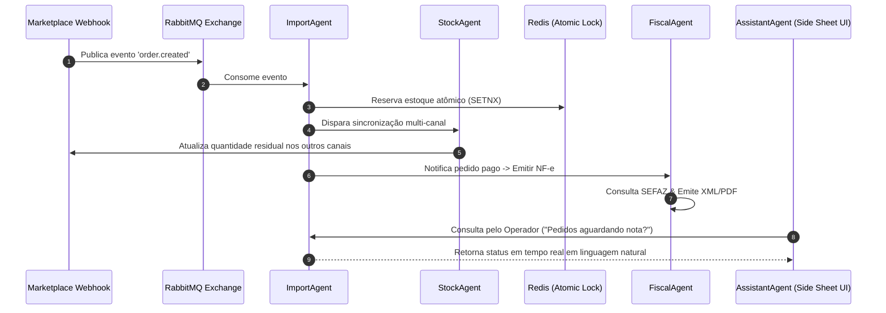

# Especificação de Arquitetura: Plataforma SaaS Omnichannel AI (BaseLinker Evolution)

Este documento descreve a arquitetura de software, padrão de design system (Material Design 3), orquestração de microsserviços, isolamento multi-tenant e modelo de eventos.

---

## 🏛️ Visão Geral da Arquitetura (Clean Architecture & DDD)

```mermaid
graph TD
    subgraph Presentation Layer
        NextUI[Next.js 14 Web App - Material Design 3]
        FastAPI_Router[FastAPI REST Routers & OpenAPI]
    end

    subgraph Application Layer
        UseCases[CQRS Use Cases & Handlers]
        Agents[9 AI Agents Core Hub]
    end

    subgraph Domain Layer
        Entities[Domain Entities & Aggregates]
        DomainEvents[Domain Events & Value Objects]
        RepositoryContracts[Repository Interfaces]
    end

    subgraph Infrastructure Layer
        PostgresAdapter[PostgreSQL Multi-Tenant DB Adapter]
        RedisAdapter[Redis Atomic Lock & Cache Adapter]
        RabbitMQAdapter[RabbitMQ Event Publisher / Consumer]
        ExternalIntegrations[Bling API v3 / Mercado Livre / SEFAZ / Carrier Adapters]
    end

    NextUI --> FastAPI_Router
    FastAPI_Router --> UseCases
    UseCases --> Entities
    Agents --> UseCases
    UseCases --> RepositoryContracts
    PostgresAdapter ..|> RepositoryContracts
    RedisAdapter ..|> RepositoryContracts
    RabbitMQAdapter ..|> RepositoryContracts
```

---

## 🤖 Orquestração dos 9 Agentes de IA



---

## 🔒 Multi-Tenancy & Segurança

1. **Isolamento de Dados**: Todas as queries e eventos possuem obrigatoriamente a chave composta `tenant_id`.
2. **Criptografia**: Tokens OAuth2 de marketplaces e chaves de API do Bling ERP são armazenados no PostgreSQL encriptados via AES-256 (`pgcrypto`).
3. **Autenticação**: JWT com rotação de Refresh Tokens e verificação 2FA (TOTP).
