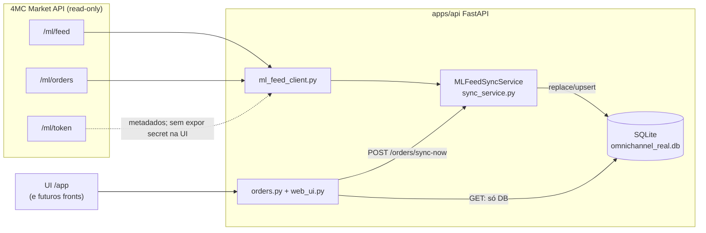

# Arquitetura: BASE ANTIGRAVITY (jrdev1 / 4M&C)

Plataforma **nativa** estilo BaseLinker para a 4M&C.  
**BaseLinker = molde de UI/UX.** **Dados de produção = Mercado Livre via API 4MC (read-only) + cache SQLite.**

Documentos irmãos: `docs/DATA_SOURCE_ML_FEED.md` (feed 4MC) · `docs/MERCADOLIVRE_API_STUDY.md` (API oficial ML) · `docs/BASELINKER_API_STUDY.md` (molde UI) · Roadmap: `docs/ROADMAP.md` · Skill: `.agents/skills/omnichannel-hub/SKILL.md`

---

## Visão em uma frase

Construir o **nosso** hub de pedidos/catálogo/expedição (paridade operacional com a experiência BaseLinker), alimentado pelo feed ML da 4MC, sem depender da API BaseLinker como fonte.

---

## Diagrama — fluxo operacional (Sprint 1)

**Regra:** página carrega → lê SQLite. Rede remota só no botão **Atualizar feed Mercado Livre** (`POST /api/v1/orders/sync-now`).

---

## Camadas do monorepo (alvo Clean Architecture)

| Camada | Papel | Onde |
|---|---|---|
| Presentation | Routers FastAPI, UI `/app` | `apps/api/src/presentation/` |
| Application / Agents | Casos de uso, orquestrador (muitos **mocks**) | `apps/api/src/agents/`, application |
| Domain | Entidades / contratos | `apps/api/src/domain/` |
| Infrastructure | SQLite, clientes HTTP ML/4MC, legado BL | `apps/api/src/infrastructure/` |

Front Next.js (`apps/web`) e pasta `KIRO/` carregam o **molde** BaseLinker (UX). Não são a fonte de dados do fluxo ML→SQLite.

---

## Molde vs fonte de dados

| Peça | Papel |
|---|---|
| Layout / status / PickPack / labels (conceito) | Molde inspirado no BaseLinker |
| `BASELINKER_API_TOKEN` / client BL | Legado / referência — **não** pipeline de produção atual |
| `ML_FEED_*` + `MLFeedSyncService` | **Fonte real** de pedidos/produtos no cache |
| `RealOrderDB` / `RealProductDB` / `SyncMetaDB` | Persistência local lida pela UI |

---

## Stack atual (honesta)

- **Backend:** FastAPI (`apps/api`)
- **Cache:** SQLite `omnichannel_real.db` (`DATABASE_URL`)
- **Integração ML:** bridge 4MC read-only (`ml_feed_client` + `sync_service`)
- **UI operacional:** Jinja/HTML em `web_ui.py` em `/app`
- **Planejado (não operacional neste fluxo):** Postgres multi-tenant, Redis locks, RabbitMQ EDA, Bling, SEFAZ, impressão ZPL (Sprint 4)

---

## Plugin architecture (future)

A aba **Integrações** em `/app` é um **hub de plugins** (molde BaseLinker): tiles com status honestos (`Conectado` / `Não configurado` / `Em breve`).

| Plugin | Estado hoje | Adapter futuro |
|---|---|---|
| **Feed ML 4MC** | **Ao vivo** (URL em settings) | Já é o pipeline de dados |
| **SQLite cache** | **Ao vivo** | Persistência local da UI |
| Mercado Livre OAuth direto | Não configurado / stub | OAuth nativo (além do bridge 4MC) |
| Bling (4M&C, Portal, Max, Star Lude, Brasil) | Em breve / Não configurado | ERP — sem API Bling implementada |
| Mercado Envios | Em breve | Contas de envio |
| NF-e / SEFAZ | Em breve | FiscalAgent |
| Base.printer | Em breve | Impressão remota / ZPL (Sprint 4) |

Catálogo editável: `apps/api/src/domain/integration_plugins.py` (`build_integration_plugins` / lista de tiles).  
**Regra:** só marcar `connected` quando houver wiring real. Stubs mostram toast de roadmap — não fingir conexão Bling/NF.

---

## Segurança & regras

1. ML **somente leitura** neste produto, salvo aprovação explícita para escrita.
2. Não devolver `access_token` do endpoint `/ml/token` para o browser.
3. Isolamento multi-tenant / JWT / AES — visão enterprise futura; o fluxo local atual é single-operator + SQLite.

---

## Arquivos-chave do sync ML

- `apps/api/src/config.py` — `ML_FEED_URL`, `ML_FEED_ORDERS_URL`, `ML_FEED_TOKEN_URL`
- `apps/api/src/infrastructure/ml_feed_client.py`
- `apps/api/src/infrastructure/sync_service.py` — classe `MLFeedSyncService`
- `apps/api/src/infrastructure/database.py`
- `apps/api/src/presentation/routers/orders.py`
- `apps/api/src/presentation/routers/web_ui.py`
