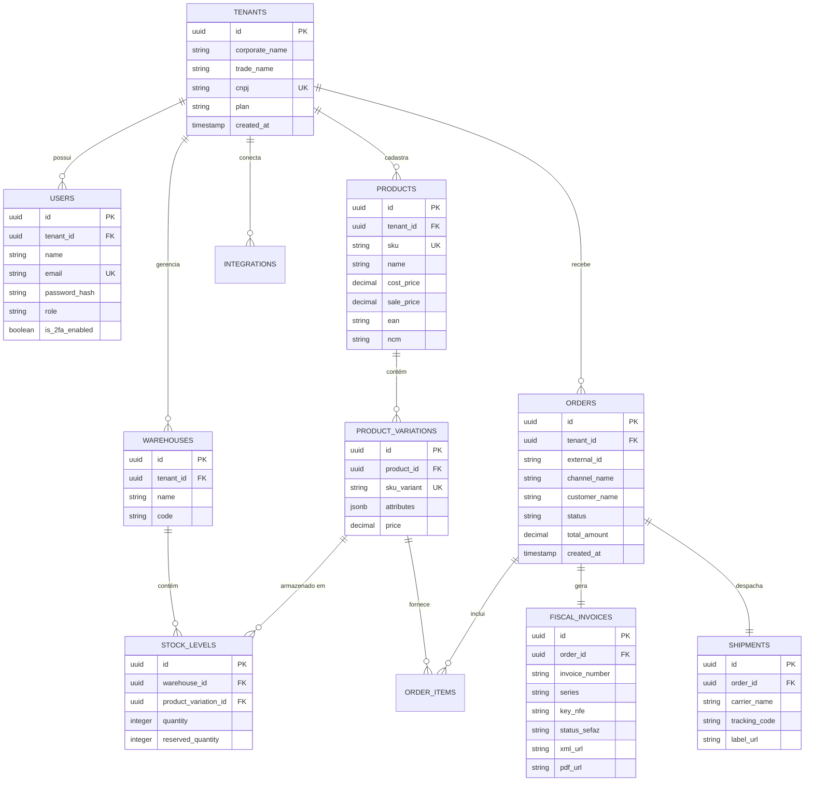

# Modelo de Banco de Dados & DER: Plataforma SaaS Omnichannel AI

Esquema de banco de dados relacional (PostgreSQL 16) com isolamento Multi-tenant por chave composta.

---

## 🗄️ Diagrama Entidade-Relacionamento (DER)



---

## 📝 Script SQL DDL de Criação (PostgreSQL Multi-tenant)

```sql
CREATE EXTENSION IF NOT EXISTS "uuid-ossp";

CREATE TABLE tenants (
    id UUID PRIMARY KEY DEFAULT uuid_generate_v4(),
    corporate_name VARCHAR(255) NOT NULL,
    trade_name VARCHAR(255) NOT NULL,
    cnpj VARCHAR(18) UNIQUE NOT NULL,
    plan VARCHAR(50) DEFAULT 'Enterprise SaaS',
    created_at TIMESTAMP DEFAULT CURRENT_TIMESTAMP
);

CREATE TABLE users (
    id UUID PRIMARY KEY DEFAULT uuid_generate_v4(),
    tenant_id UUID REFERENCES tenants(id) ON DELETE CASCADE,
    name VARCHAR(255) NOT NULL,
    email VARCHAR(255) UNIQUE NOT NULL,
    password_hash VARCHAR(255) NOT NULL,
    role VARCHAR(50) DEFAULT 'Admin',
    is_2fa_enabled BOOLEAN DEFAULT TRUE,
    created_at TIMESTAMP DEFAULT CURRENT_TIMESTAMP
);

CREATE TABLE products (
    id UUID PRIMARY KEY DEFAULT uuid_generate_v4(),
    tenant_id UUID REFERENCES tenants(id) ON DELETE CASCADE,
    sku VARCHAR(100) NOT NULL,
    name VARCHAR(255) NOT NULL,
    cost_price NUMERIC(12, 2) DEFAULT 0.00,
    sale_price NUMERIC(12, 2) NOT NULL,
    ean VARCHAR(14),
    ncm VARCHAR(8),
    created_at TIMESTAMP DEFAULT CURRENT_TIMESTAMP,
    CONSTRAINT uk_tenant_sku UNIQUE (tenant_id, sku)
);
```
