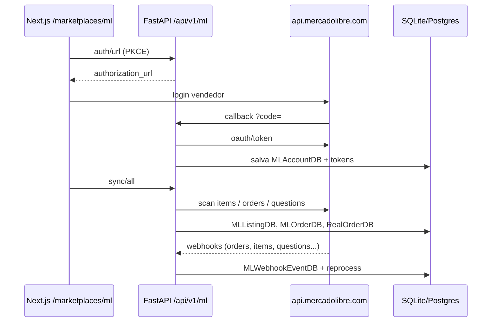

# Estudo da API Mercado Livre × Projeto Omnichannel

> Gerado em **07/08/2026** · Fontes oficiais + código em `apps/api` / `apps/web`.  
> Objetivo: orientar o caminho **ML nativo** (sem depender do BaseLinker) para funções de vendedor.

---

## 1. Fontes oficiais (estude nesta ordem)

| # | Tema | URL |
|---|---|---|
| 1 | Portal API Docs | https://developers.mercadolivre.com.br/pt_br/api-docs |
| 2 | OAuth / Autorização (PKCE) | https://developers.mercadolivre.com.br/pt_br/autenticacao-e-autorizacao |
| 3 | Publicação de produtos | https://developers.mercadolivre.com.br/pt_br/publicacao-de-produtos |
| 4 | Pedidos e opiniões | https://developers.mercadolivre.com.br/pt_br/pedidos-e-opinioes |
| 5 | Mercado Envios 2 | https://developers.mercadolivre.com.br/pt_br/mercado-envios-2 |
| 6 | Notificações (webhooks) | https://developers.mercadolivre.com.br/pt_br/notificacoes |
| 7 | DevCenter (criar app) | https://developers.mercadolivre.com.br/devcenter |
| 8 | Base API | `https://api.mercadolibre.com` |
| 9 | Auth BR | `https://auth.mercadolivre.com.br` |

**Unidade de negócio:** Marketplace (vendedor MLB).  
**Auth:** OAuth 2.0 Authorization Code + **PKCE (S256)** + `refresh_token` (uso único).

---

## 2. Regras críticas da documentação (não violar)

1. **Access token** dura **6 horas** → renovar com refresh **só quando expirar**.
2. **Refresh token** é **uso único** → sempre persistir o novo `refresh_token` (o projeto já faz isso em `ml_sync_service.build_client`).
3. **redirect_uri** deve ser **idêntica** à cadastrada no DevCenter (sem query variável).
4. Login do grant deve ser conta **administrador**, não colaborador (`invalid_operator_user_id`).
5. Header: `Authorization: Bearer APP_USR-...` (nunca token no browser — tokens ficam no FastAPI).
6. Pedidos/envios modernos: header **`x-format-new: true`** em `/shipments` (estrutura nova).
7. **Fulfillment (Full):** vendedor **não imprime etiqueta de venda** — só etiqueta de estoque para depósito ML.
8. Rate limit: ML responde **429**; o client já tem semáforo + retry. Evitar polling agressivo — preferir **webhooks**.
9. Mensagens automáticas repetitivas podem gerar **penalidade** na conta.
10. App sem uso por **4 meses** pode invalidar o grant.

---

## 3. Mapa: módulos ML oficiais × nosso código

### Legenda
- ✅ Implementado e usável  
- 🟡 Parcial (API/client existe, UI ou fluxo incompleto)  
- ❌ Não implementado  

| Módulo ML (doc) | Endpoints típicos | Status no projeto | Arquivos |
|---|---|---|---|
| OAuth + PKCE + refresh | `/oauth/token`, auth.mercadolivre.com.br | ✅ | `mercadolivre_client.py`, `routers/mercadolivre.py` `/auth/*` |
| Contas multi-seller | `/users/me` | ✅ | `MLAccountDB`, `/ml/accounts` |
| Categorias + atributos + predict | `/categories`, `/category_predictor` | ✅ | client + `/ml/categories*` |
| De-para categorias | (tabela local) | ✅ | `MLCategoryMapDB` |
| Anúncios CRUD / preço / estoque | `/items`, `/users/{id}/items/search` + **scan** | ✅ | sync + listings API |
| Pausar / ativar / fechar / bulk | `PUT /items/{id}` status | ✅ / 🟡 close parcial | router listings |
| Descrição | `/items/{id}/description` | ✅ client / 🟡 UI | client |
| Pedidos | `/orders/search`, `/orders/{id}` | ✅ sync → `MLOrderDB` + espelho `RealOrderDB` | `ml_sync_service.py` |
| Envios + etiqueta PDF | `/shipments`, labels | 🟡 | get shipment + label no router |
| Fulfillment stock | stock fulfillment | 🟡 | `get_fulfillment_stock` no client |
| Perguntas Q&A | `/questions/search`, answer | ✅ | router questions |
| Webhooks | POST notificação + processar | 🟡 | `/ml/webhooks*` (validar topics completos) |
| Taxas (fees) | listing fees | ✅ | `/ml/fees/simulate` |
| Visitas / métricas | visits | 🟡 | endpoint visits |
| Promoções | seller promotions v2 | 🟡 | `get_item_promotions` só leitura |
| Mensagens pós-venda | `/messages` | ❌ | — |
| Claims / mediações | `/claims`, `/post-purchase` | ❌ | — |
| Packs / carrinho | `pack_id` / packs | 🟡 campo em order | sem UI de pack |
| Feedback / reputação | order feedback | ❌ | — |
| Notas no pedido | order notes | ❌ | — |
| User Products / stock multi-depósito | `/user-products/.../stock` + `x-version` | ❌ | estoque ainda via `/items` clássico |
| Flex / Coleta / Places | shipping modes | ❌ | — |
| Faturador / NF no ML | `/users/{id}/invoices/...` | ❌ | fiscal hoje é outro eixo |
| Billing / liberação | billing / settlements | ❌ | — |
| Moderação / qualidade anúncio | item health (parcial) | 🟡 | campo `health` no listing |
| Variações / catálogo | variations, catalog_listing | 🟡 flags | publicação variações incompleta |

---

## 4. O que o projeto já faz bem (base sólida)

```
apps/api/src/infrastructure/mercadolivre_client.py   (~440 linhas)
apps/api/src/infrastructure/ml_sync_service.py        (sync → DB + RealOrderDB)
apps/api/src/presentation/routers/mercadolivre.py     (~840 linhas, prefix /api/v1/ml)
apps/web/src/lib/ml/client.ts                        (proxy seguro ao backend)
apps/web/src/app/(app)/marketplaces/mercadolivre/     (UI conectar + anúncios)
```

Fluxo atual:



---

## 5. Gap para “funções de painel” estilo BaseLinker **só no ML**

BaseLinker multi-canal ≠ API ML. Abaixo é o gap **realista** usando só Mercado Livre + nosso hub interno.

| Capacidade desejada | Via API ML? | Gap |
|---|---|---|
| Conectar conta / multi-conta | Sim | Quase pronto ✅ |
| Gerir anúncios (preço/estoque/pause) | Sim | UI avançada (variações, descrição, fotos) |
| Hub de pedidos unificado + status custom | Parcial | Status custom é **nosso** (não existe no ML como no BL) |
| PickPack / filas | Não nativo | Construir em cima de `MLOrderDB` |
| Etiqueta Mercado Envios | Sim | Completar UI + `x-format-new` + modos Flex/Full |
| Full (fulfillment) | Sim (limitado) | Stock inbound + sem label de venda |
| Perguntas | Sim | ✅ |
| Chat / mensagens | Sim | ❌ implementar |
| Reclamações (claims) | Sim | ❌ implementar |
| NF-e Brasil | Faturador ML + SEFAZ | ❌ eixo fiscal separado |
| WMS / PO / transferências | Não | Produto próprio (não é ML) |
| Automações SE→ENTÃO | Não | Motor interno + triggers webhook |
| Shopee/Amazon/etc. | Não | Outras APIs |

**Estimativa honesta:**  
- Painel ML operacional (anúncios + pedidos + envios + Q&A + claims + msgs): **~40–50% feito**.  
- “Clone BaseLinker completo” via ML: **impossível só com ML** — falta OMS próprio + outros canais.

---

## 6. Endpoints prioritários para estudar / implementar

### P0 — Operação diária (próximos sprints)
| Recurso | Método | Nota |
|---|---|---|
| `/orders/search` | GET | Já usado; filtrar `order.status`, date |
| `/orders/{id}` | GET | Já usado |
| `/shipments/{id}` | GET | Header `x-format-new: true` |
| Labels shipment | GET | Já há PDF; tratar Full vs drop_off |
| `/items/{id}` | PUT | Variações, shipping, pictures |
| Notifications topics | webhook | `orders_v2`, `shipments`, `items`, `questions`, `messages`, `claims`, `stock_*` |

### P1 — Pós-venda
| Recurso | Uso |
|---|---|
| Messages API | Chat comprador–vendedor |
| Claims / mediations | Contestações |
| Order feedback | Avaliação |
| Packs | Pedidos de carrinho |

### P2 — Estoque moderno & Full
| Recurso | Uso |
|---|---|
| User Products stock | Multi-depósito + `x-version` optimistic lock |
| Fulfillment stock / inbound | Full |
| Shipping options / Flex | Cotação e modos |

### P3 — Monetização & compliance
| Recurso | Uso |
|---|---|
| Seller promotions v2 | Campanhas |
| Billing / settlements | Financeiro canal |
| Invoices (faturador) | NF no fluxo ML |
| Moderação / quality | Saúde do anúncio |

---

## 7. Pipeline de prompts — ML nativo (6 sprints)

### ▶ ML-S1 — Endurecer OAuth, webhooks e `x-format-new`

```
Estude https://developers.mercadolivre.com.br/pt_br/autenticacao-e-autorizacao
e https://developers.mercadolivre.com.br/pt_br/notificacoes

No projeto (apps/api):
1. Garantir PKCE S256, state CSRF, persistência atômica do refresh_token (já parcialmente feito — revisar race conditions no refresh_lock).
2. Validar todos os topics de webhook: orders_v2, shipments, items, questions, messages, claims, payments, stock_locations, stock_fulfillment.
3. Em get_shipment / labels, enviar header x-format-new: true conforme doc Mercado Envios 2.
4. Documentar no .env.example: ML_CLIENT_ID, ML_CLIENT_SECRET, ML_REDIRECT_URI, ML_WEBHOOK_SECRET, ML_SITE_ID=MLB.
5. Testar com usuário de teste do DevCenter.

Não alterar UI neste sprint.
```

### ▶ ML-S2 — Order Hub ML (UI + status interno)

```
Usar MLOrderDB + RealOrderDB como fonte.
Criar/aprimorar página apps/web/.../marketplaces/mercadolivre/orders (ou unificar /orders com filtro channel=ML).

Features:
- Listar pedidos ML com status ML + status interno (nosso workflow estilo Base).
- Detalhe: itens, pagamento, buyer, shipment_id, pack_id.
- Ações: sync refresh, abrir etiqueta (se não for fulfillment), marcar status interno.
- Webhook orders_v2 deve atualizar a linha em <5s após process.

Espelhar pedidos ML em RealOrderDB (ml_sync_service já faz — validar campos).
```

### ▶ ML-S3 — Envios completos (drop_off, Flex, Full)

```
Doc: Mercado Envios 2.
1. Detectar logistic_type / shipping_mode do shipment.
2. Se fulfillment: NÃO oferecer "imprimir etiqueta de venda"; oferecer fluxo de estoque Full.
3. Se drop_off / xd_drop_off / self_service: baixar label PDF e exibir tracking.
4. UI stepper a partir do pedido ML.
5. Expandir mercadolivre_client com helpers tipados para cada modo.
```

### ▶ ML-S4 — Publicação avançada (variações, fotos, atributos obrigatórios)

```
Doc: publicação de produtos.
1. Fluxo criar anúncio: predict category → attributes obrigatórios → formulário dinâmico → POST /items.
2. Upload de imagens (API pictures).
3. Variações (size/color) quando a categoria exigir.
4. Editar descrição (plain_text) na UI.
5. Usar MLCategoryMapDB no de-para do catálogo interno.
```

### ▶ ML-S5 — Mensagens + Claims

```
Implementar no client + router + UI:
- Listar/enviar messages por order/pack
- Listar claims, responder, anexar
Respeitar regras anti-spam da doc (sem mensagem automática repetitiva).
Webhooks messages + claims.
```

### ▶ ML-S6 — User Products stock + Promoções + Fees no Order Hub

```
1. Migrar update de estoque de PUT /items quantity para user-products stock (com x-version) onde aplicável.
2. UI de promoções (seller-promotions v2) — ao menos listar/opt-in.
3. No detalhe do pedido, mostrar sale_fee / net estimado.
4. Relatório simples: visitas + conversão por anúncio.
```

---

## 8. Variáveis de ambiente

```env
ML_CLIENT_ID=
ML_CLIENT_SECRET=
ML_REDIRECT_URI=http://localhost:8000/api/v1/ml/auth/callback
ML_SITE_ID=MLB
ML_WEBHOOK_SECRET=
```

App no DevCenter: scopes `read` + `write` + `offline_access`.  
URL de notificação: HTTPS público apontando para `POST /api/v1/ml/webhooks`.

---

## 9. Checklist de estudo (para você / o agente)

Ao ler a doc oficial, anote e traga para o código:

```
[ ] OAuth PKCE + refresh único
[ ] Topics de notificação que o app vai assinar
[ ] Diferença items clássicos vs user-products
[ ] Modos de envio: drop_off, xd_drop_off, self_service, fulfillment
[ ] Quando NÃO imprimir etiqueta
[ ] Pack vs order
[ ] Claims SLA e estados
[ ] Regras de mensagens
[ ] Faturador / invoice (BR)
[ ] Limites 429 e boas práticas de sync (preferir webhook a poll)
```

---

## 10. Relação com o roadmap BaseLinker

| Roadmap | Quando usar |
|---|---|
| `docs/PIPELINE_PROMPTS_ROADMAP.md` | Paridade UI/API **via BaseLinker** |
| **Este arquivo** | Operação **nativa ML** (sem BL) |
| `docs/ROADMAP.md` (SaaS) | Visão multi-canal + agentes (longo prazo) |

Estratégia sugerida: **ML-S1→S3 primeiro** (ganho operacional no canal principal), em paralelo manter BL só como ponte se ainda precisar de outros canais.

---

*Doc vivo — atualizar quando a API ML mudar (promoções v2, user-products, faturador).*
