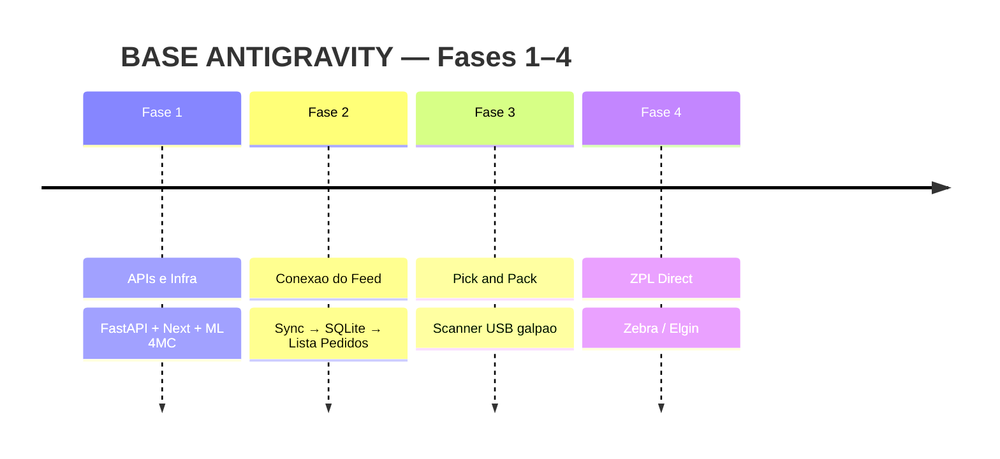

# Roadmap: BASE ANTIGRAVITY (jrdev1 / 4M&C)

**Produto:** nosso hub estilo BaseLinker (pedidos, catálogo, expedição, financeiro local).  
**Molde:** UI/UX inspirada no BaseLinker.  
**Dados:** Mercado Livre via API 4MC read-only + SQLite local (`omnichannel_real.db`).

Skill: `.agents/skills/omnichannel-hub/SKILL.md` · Dados: `docs/DATA_SOURCE_ML_FEED.md` · API oficial ML: `docs/MERCADOLIVRE_API_STUDY.md` · Arquitetura: `docs/ARCHITECTURE.md` · Estudo BL (molde): `docs/BASELINKER_API_STUDY.md`

---

## Quadro oficial de fases (fonte da verdade)

| Fase | Entrega | Status |
|---|---|---|
| **1 — APIs e Infra** | FastAPI + Next.js (KIRO) + bridge API ML 4MC | 🟢 **CONCLUÍDO** |
| **2 — Conexão do Feed** | Sync `/ml/feed` + `/ml/orders` → SQLite → **Guia Pedidos → Lista de pedidos** em `/app` | 🟡 **QUASE FEITO** — lista + sync na UI; vazio honesto se upstream 0; falta só pedidos reais no bridge para “encher” a lista |
| **3 — Bipagem Pick & Pack** | Scanner USB no galpão | 🔴 **PENDENTE** — não iniciar agora |
| **4 — Impressão ZPL Direct** | Envio direto Zebra/Elgin | 🔴 **PENDENTE** — não iniciar agora |

### Critérios de aceite — Fase 2

- [x] URLs `ML_FEED_*` + `MLFeedSyncService` + SQLite
- [x] `POST /api/v1/orders/sync-now` e botão na UI `/app`
- [x] GETs de pedidos/dashboard **não** batem no 4MC a cada load
- [x] Guia Pedidos (molde BaseLinker) com **Lista de pedidos** ligada ao cache local
- [ ] Bridge 4MC com pedidos reais na conta (`total_orders_paid` / `paging.total` > 0) — **depende do upstream**; zero no bridge = lista vazia honesta + sync ok

### Módulos UI (molde) — estado honesto

| Módulo | O que é real | O que é placeholder |
|---|---|---|
| **Pedidos** | Lista + status + clientes derivados + CSV + sync | Faturas/NF, devoluções, e-mail/SMS, transferências, print |
| **Produtos** | Lista SQLite + inventário resumido + CSV + sync | Ações automáticas, import |
| **Financeiro** | **Financeiro detalhado** = relatório local (totais, status, dias, tabela) a partir de `RealOrderDB` | Bling/SEFAZ/conciliação — **não inventar** |

---

## Visão longa (omnichannel)

Fases aspiracionais depois da 4: multi-canal, fiscal (Bling/SEFAZ), WhatsApp/CRM, financeiro ERP, AssistantAgent com LLM.  
**Não** marcar como concluídas.

Detalhe de paridade de molde UI: `docs/PIPELINE_PROMPTS_ROADMAP.md` — útil para UX, **não** redefine a fonte de dados.

---

## O que não fazer no roadmap curto

- Tratar BaseLinker API como produção.
- Escrever estoque/preço no ML sem aprovação.
- Iniciar Fase 3 (pick&pack) ou Fase 4 (ZPL) antes da Fase 2 estável.
- Inventar dados financeiros/fiscais (Bling/SEFAZ) no relatório.
- Polling contínuo do feed (cache + sync explícito).
