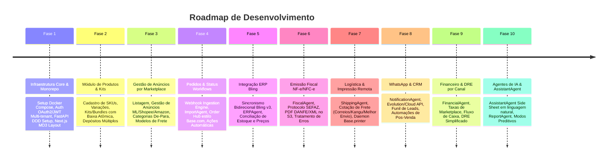

# Roadmap Técnico do Projeto: Plataforma SaaS Omnichannel AI (BaseLinker Evolution)

Este documento detalha o planejamento por Fases, entregáveis, status de execução e critérios de aceite para a plataforma.

---

## 🎯 Visão do Produto

Entregar uma plataforma SaaS Omnichannel de gestão de e-commerce enterprise inspirada no BaseLinker, integrada com Bling ERP, Mercado Livre, Shopee, Amazon, Magalu, WooCommerce, Shopify, Loja Integrada, Correios, Kangu, Melhor Envio, WhatsApp e NF-e/NFC-e, com interface Material Design 3 e 9 Agentes de IA autônomos.

---

## 🏁 Fases de Desenvolvimento

---

## 📊 Status das Fases

### 🟢 FASE 1: Infraestrutura Core, Monorepo & Auth (Em Andamento / Concluída)
- [x] Docker Compose com PostgreSQL 16, Redis 7 e RabbitMQ 3.13.
- [x] Estrutura Monorepo (`apps/web` e `apps/api`).
- [x] Arquitetura Backend FastAPI com DDD (Domain, Application, Infrastructure, Presentation).
- [x] Arquitetura Frontend Next.js 14 com Material Design 3 (`@mui/material`).
- [x] Autenticação OAuth2 + JWT com isolamento Multi-tenant e 2FA.

### 🟡 FASE 2: Produtos, Inventário & Kits (Em Progresso)
- [x] Modelos de dados para Produtos, Variações, SKUs e Categorias.
- [x] Motor de Kits & Bundles com controle de componentes.
- [x] Controle de Estoque Multi-depósito com trava atômica em Redis (`SETNX`).

### 🟡 FASE 3: Gestão de Anúncios por Marketplace (Base.com Spec)
- [x] Sub-módulo Mercado Livre / Shopee / Amazon (Listagem, Gestão de Anúncios, De-Para Categorias).
- [x] Tabela de Tamanhos, Modelos de Anúncio e Central de Promoções.

### 🟡 FASE 4: Pedidos, Status Workflows & Webhooks
- [x] Webhook Ingestion Engine & `ImportAgent`.
- [x] Interface de Pedidos com Sidebar de Status de Separação (Estilo Base.com).
- [x] Triggers de Ações Automáticas "SE [Evento] ENTÃO [Ação]".

### 🟡 FASE 5: Integração Bling ERP & Multi-Contas
- [x] `ERPAgent` para integração Bling API v3.
- [x] Árvore de Topologia Visual de Integrações no Frontend.

### 🟡 FASE 6: Fiscal & NF-e (SEFAZ)
- [x] `FiscalAgent` para validação de regras fiscais e emissão.
- [x] Download em lote de pacotes ZIP com XML/PDF.

### 🟡 FASE 7: Logística & Daemon de Impressão Remota (`Base.printer`)
- [x] `ShippingAgent` para cotação e geração de etiquetas térmicas ZPL/PDF.
- [x] Especificação do daemon de impressão local.

### 🟡 FASE 8: WhatsApp Cloud / Evolution API & CRM
- [x] `NotificationAgent` para automação de mensagens de rastreio.
- [x] Funil de CRM e Gestão de Leads.

### 🟡 FASE 9: Financeiro & DRE por Canal
- [x] `FinancialAgent` para conciliação de taxas de marketplace e frete.

### 🟡 FASE 10: Agentes de IA & Executivo Conversacional
- [x] `AssistantAgent` integrado no Side Sheet MD3 para perguntas em linguagem natural.
- [x] `ReportAgent` para relatórios preditivos de demanda.

---

## 📌 Critérios de Aceite Globais

1. **Desempenho**: Tempo de resposta de API $< 100\text{ms}$ para rotas de leitura e sincronização de estoque $< 1\text{s}$ em todos os canais.
2. **Segurança**: Testes OWASP Top 10 aprovados e isolamento estrito por `tenant_id`.
3. **Usabilidade**: 100% das telas em conformidade com as 10 Heurísticas de Nielsen e Material Design 3.
